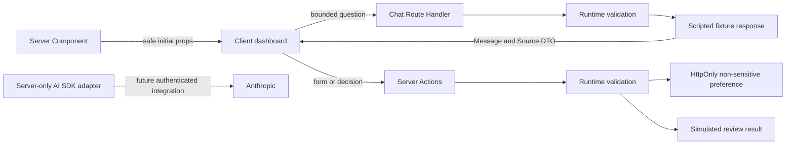

# Architecture and Module 1 boundary mapping

## Product continuity

Source: [CoinPilot AI Module 1 product brief](https://github.com/PenielOkoli/coinpilot-ai/blob/main/docs/product-brief.md), [system diagram](https://github.com/PenielOkoli/coinpilot-ai/blob/main/docs/system-diagram.md), and [risk register](https://github.com/PenielOkoli/coinpilot-ai/blob/main/docs/risk-register.md), reviewed 7 October 2026. This project preserves the chat-first experience, Anthropic choice, visible uncertainty, and human review requirement. The source brief is a plan; this foundation implements bounded demonstrations of those flows.

## Applied mental model

A Server Component renders from server-accessible data without shipping its component code to the browser. `src/app/page.tsx` reads a validated preference and creates the initial dashboard props. It is dynamic because it reads cookies. `src/app/architecture/page.tsx` needs no browser state and stays a Server Component.

A Client Component owns interaction. `src/components/dashboard.tsx` uses hooks for navigation, drafts, pending states, and rendered messages. The `use client` directive defines the client module boundary; it does not mean the component can never be prerendered on the server. Every runtime dependency imported under that boundary must be safe to ship. Shared type imports are erased by TypeScript.

A Server Action is an async server function invoked through a framework-managed POST. `savePreferences` and `reviewProposal` use `use server`, accept untrusted inputs, validate them, and return a discriminated result. Server Actions are not components and are not automatically authenticated. Their references can be used by a Client Component without bundling their implementation. This phase exposes only harmless demo operations.

A Route Handler defines an HTTP interface. `POST /api/chat` is appropriate for a chat transport because future streaming can use the same endpoint. Today it returns JSON, validates its own payload, bounds actual request bytes, and never forwards browser instructions to a paid provider.

## Mapping to the real brief

| Module 1 capability | Client responsibility | Server responsibility | Phase 1 evidence / later work |
| --- | --- | --- | --- |
| Signal chat | Compose a question, show pending/error state, render source/confidence metadata | Validate input and construct the response; later assemble trusted context and call model/tools | Working JSON demo endpoint and typed `Message`; later streaming and grounding |
| Portfolio risk | Display holdings and concentration | Fetch only the authenticated user's portfolio and compute validated evidence | Sample portfolio DTO; no account or exchange data yet |
| Assistive drafting | Display structured proposal with risk/reasoning | Validate model proposals and risk constraints | Typed sample `Proposal`; automated drafting remains future work |
| Review and approval | Deliberate approve/reject, explicit acknowledgement, result feedback | Revalidate proposal and decision; later authenticate, bind exact parameters, enforce expiry and replay protection | Server Action demonstrates the boundary; simulation is not execution authorization |
| Failure/degraded mode | Clearly label unavailable verification; retain source provenance | Handle unavailable/stale data without pretending it is current | Outage switch exercises the route's deterministic fallback |
| Preferences | Editable risk form with pending/result state | Validate enum, write HttpOnly preference, read on server load | Implemented for one non-sensitive preference; later move to authenticated database |
| Conversation history | Render only the current user's authorized messages | Persist and retrieve per authenticated session | Deferred; React memory only, no persistence or localStorage |
| External tools | Show sanitized outcomes | Own API credentials, authorize tool operations, limit arguments and outputs | Shared tool contracts; no market or exchange tool enabled |

## Request paths

No exchange execution path exists. `server-only` imports in sensitive modules turn accidental imports into a client graph into build errors. Secrets are read inside the optional adapter; no environment object is serialized into page props.

## TypeScript and trust

Strict TypeScript defines `Message`, `Source`, `ToolDefinition`, generic `ToolResult<T>`, `Proposal`, and `ActionResult<T>`. Union values constrain roles, risk, freshness, and review state. `ActionResult` forces the UI to handle failure before accessing success data. Types improve compile-time correctness but do not validate HTTP or form inputs; Zod performs those checks at runtime.

## Deliberate foundation tradeoffs

The small app uses one dashboard client island to keep shared UI state understandable. The page and architecture content remain server-rendered; future data-heavy panels can become separate Server Components. Navigation is local workspace state, so tabs are not separate bookmarkable routes.

The brief's server-side database preference storage is deferred. The demo uses a validated HttpOnly cookie for an enum only. The cookie is not a session, authentication proof, or trusted risk authorization; users can forge it and still only select an allowed enum. Conversations are neither saved to browser storage nor persisted on the server yet. Demo approval is stateless and repeatable because it has no financial side effects. Production approval must not reuse this mechanism.

References: [Next.js Server and Client Components](https://nextjs.org/docs/app/getting-started/server-and-client-components), [Server Functions and Actions](https://nextjs.org/docs/app/api-reference/directives/use-server), [Environment variables](https://nextjs.org/docs/app/guides/environment-variables), [TypeScript Handbook](https://www.typescriptlang.org/docs/handbook/intro.html).
